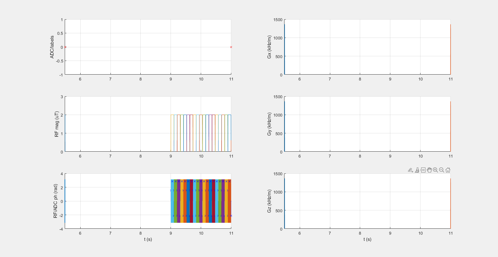

## APTw_3T_004_2uT_19SL_DC95_2s_braintumor

### Description
APTw brain tumor protocol for 3T
* B1,rms = B1pure = 2 µT
* Tsat = 1.990 s
* DCsat = 95 % 

this file requires pulseq-cest sim commit
94484e494e4897287ab0c78160bf654106feeff7 or later, as previously weff sign  error lead to artifacts
see also https://github.com/kherz/pulseq-cest/pull/6

### Publication
Roeloffs, V., Meyer, C., Bachert, P., and Zaiss, M. (2014) Towards quantification of pulsed spinlock and CEST at clinical MR scanners: an analytical interleaved saturation–relaxation (ISAR) approach, NMR Biomed., 28, 40– 53, doi: 10.1002/nbm.3192. 

### Plot
 

