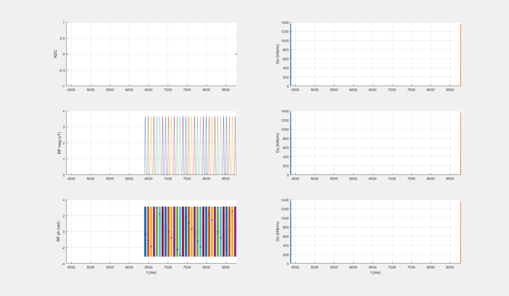

## DGE_7T_001_1p88uT_32SincGauss_DC66_2375ms_braintumor

**NOT approved yet**

### Description
Dynamic glucose enhanced (DGE) brain tumor protocol for 7T

* B1,cwpe = 1.88 µT 
* Tsat = 2.375 s
* DCsat = 67 %

### Publication

Xu X, Yadav NN, Knutsson L, Hua J, Kalyani R, Hall E, Laterra J, Blakeley J, Strowd R, Pomper M, Barker P, Chan K, Liu G, McMahon MT, Stevens RD, van Zijl PC. Dynamic Glucose-Enhanced (DGE) MRI: Translation to Human Scanning and First Results in Glioma Patients. Tomography. 2015 Dec;1(2):105-114. doi: https://doi.org/10.18383/j.tom.2015.00175

### Plot
 

