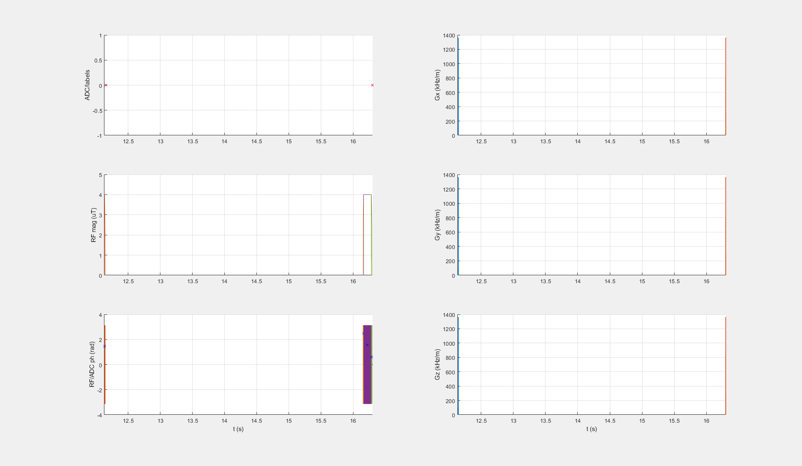

## DGErho_3T_001_4uT_adiaSL_DC100_120ms_braintumor

### Description
DGEρ  protocol for 3T
* B1,cwpe = 4 µT
* Tsat = 120 ms

### Publication

[T1ρ‐based dynamic glucose‐enhanced (DGEρ) MRI at 3 T: method development and early clinical experience in the human brain](https://doi.org/10.1002/mrm.27857)

### Plot
 
