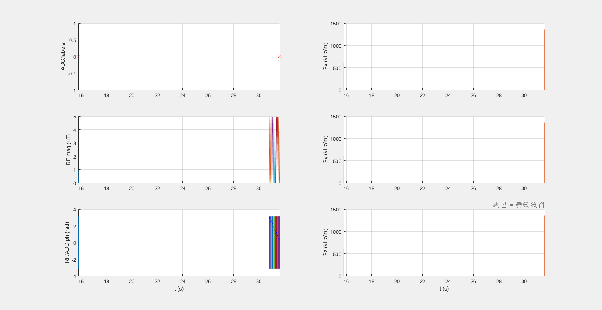

## Glu_7T_001_3uT_8Hannning_DC99_800ms

**NOT approved yet**

### Description
Glutamate weighted protocol for 7T

* B1,cwpe = 3 µT 
* Tsat = 0.8 s
* DCsat = 99 %

### Publication
 Nanga, RPR, DeBrosse, C, Kumar, D, et al. Reproducibility of 2D GluCEST in healthy human volunteers at 7 T. Magn Reson Med. 2018; 80: 2033– 2039. https://doi.org/10.1002/mrm.27362 

### Plot
 

