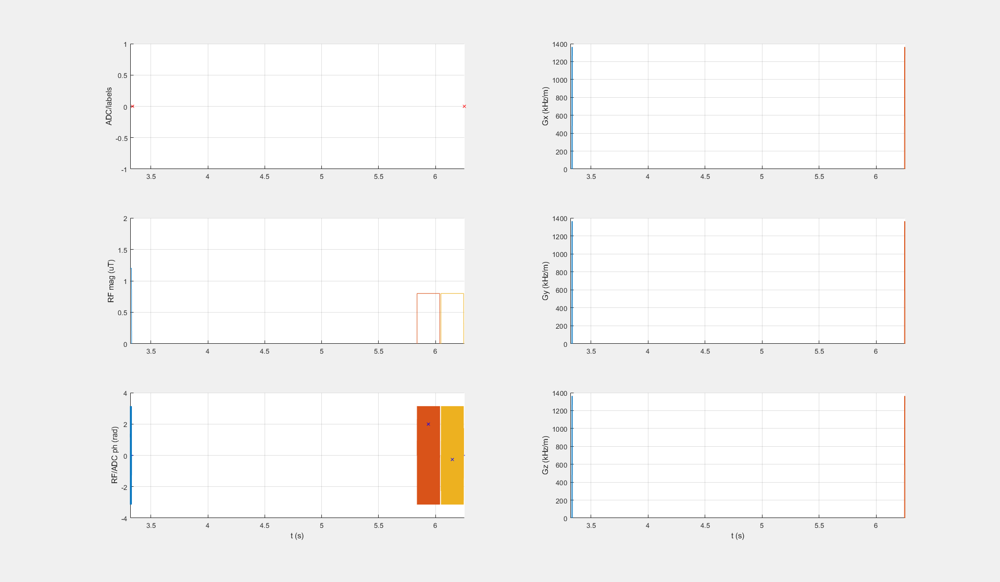

## MRF_CEST_3T_001_block_brain

**NOT approved yet**

### Description
MRF CEST protocol for 3T

* Varying parameters over measurements

### Publication
 Heo, H. Y., Han, Z., Jiang, S., Schär, M., van Zijl, P. C., & Zhou, J. (2019). Quantifying amide proton exchange rate and concentration in chemical exchange saturation transfer imaging of the human brain. Neuroimage, 189, 202-213. https://doi.org/10.1016/j.neuroimage.2019.01.034 

### Plot
 

