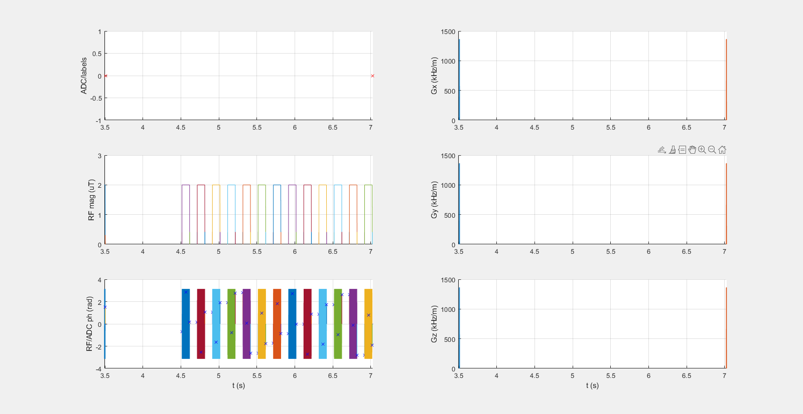

## MRF_CEST_MT_3T_003_13SL_DC50_2500ms

### Description
CEST Fingerprinting Protocol for MT
* B1,cwpe = 0 - 4 µT
* Tsat = 2.5 s
* DCsat = 50 % 

### Publication

Perlman, O., Ito, H., Herz, K. et al. Quantitative imaging of apoptosis following oncolytic virotherapy by magnetic resonance fingerprinting aided by deep learning. *Nat. Biomed. Eng* **6**, 648–657 (2022). https://doi.org/10.1038/s41551-021-00809-7

### Plot
 

