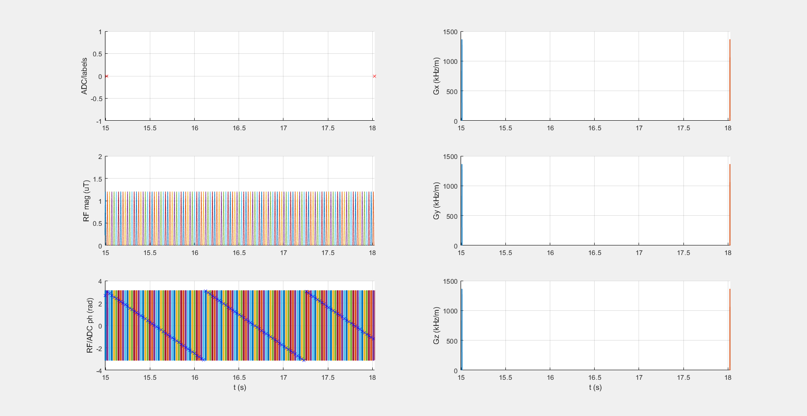

## MultiPool_7T_001_0p57uT_120Gauss_DC60_3s_brain

### Description
Multi-pool protocol for 7 T

* B1,rms = 0.57 µT 
* Tsat = 2.99 s
* DCsat = 60 %

### Publication

MP_1 (//GUFI TH2//)

https://cest-sources.org/doku.php?id=standard_cest_protocols

### Plot
 

