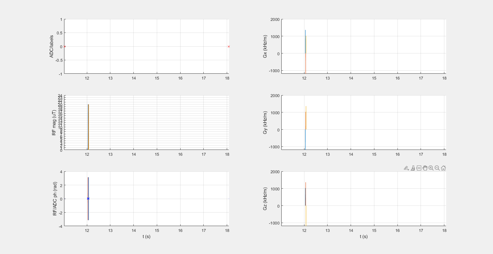

## T1map_001_3HypSec

### Description
Saturation/dephasing recovery protocol for T1 mapping using 18 different recovery times (TI). The preparation consists of adiabatic half passage pulses (AHP) and subsequent gradient spoiling. 
#### Protocol settings:
* nummeas = 18
* trec = 1 s   
* TI = [10 6 5 4 3 2.5 2 1.5 1 0.9 0.8 0.7 0.6 0.5 0.4 0.3 0.2 0.1] s
#### AHP settings:  
* \# of pulses = 3
* B1, AHP = 20 µT
* tAHP = 8 ms
* BWAHP = 1200 Hz
* µAHP = 6

### Plot

 
