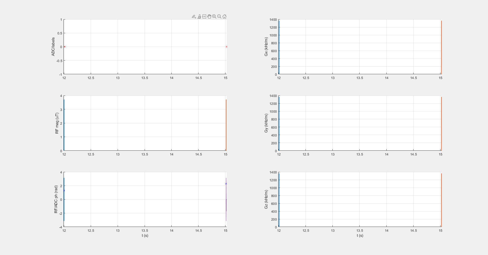

## WASABI_3T_001_3p7uT_1block_5ms

### Description
WASABI protocol for simultaneous B0 and B1 mapping at 3T
* B1,cwpe = 3.7 µT
* tp = 5 ms
* nummeas = 32

### Publication
[Simultaneous mapping of water shift and B1 (WASABI) - Application to field-Inhomogeneity correction of CEST MRI data.](https://doi.org/10.1002/mrm.26133)

### Plot

 
